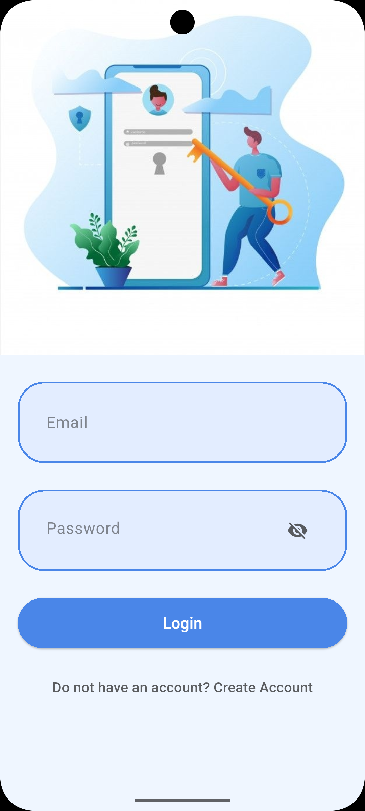
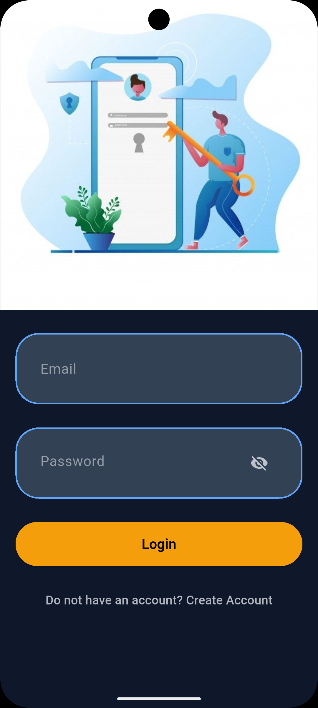
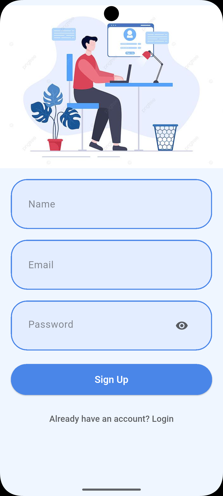
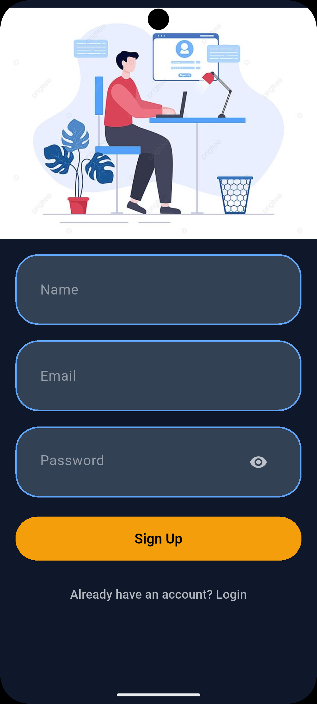
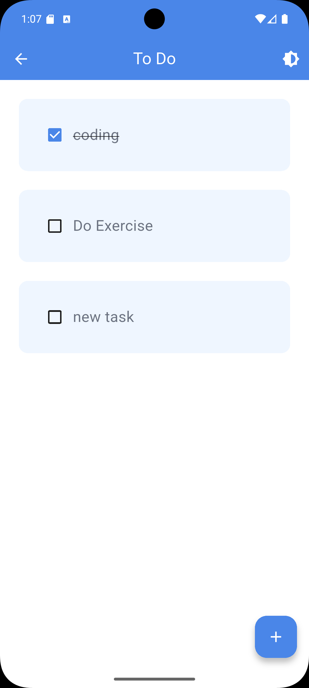
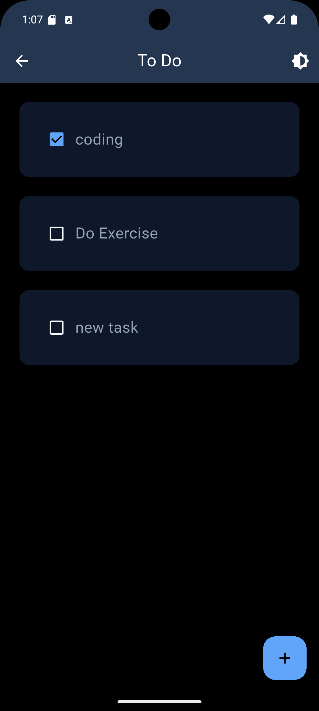

# Todo App ✅

A modern Flutter-based Todo application with Firebase Authentication and Hive local storage.  
The app allows users to securely manage daily tasks with a clean Material 3 UI.

---

## ✨ Features

- 🔐 Firebase Login & Signup Authentication
- 📝 Add, Edit, Delete Tasks
- 💾 Local Storage using Hive
- 🎨 Modern Material 3 UI
- 🌙 Light/Dark Theme Toggle
- ⚡ Fast and Lightweight

---

## 🛠️ Tech Stack

- Flutter
- Dart
- Firebase Authentication
- Hive Database
- Material 3

---

## 📂 Folder Structure

```bash
lib/
├── models/
├── screens/
├── services/
├── theme/
├── widgets/
└── main.dart
```

---

## 📸 Screenshots

### Login Screen

| Light Theme | Dark Theme |
|-------------|------------|
|  |  |

---

### Signup Screen

| Light Theme | Dark Theme |
|-------------|------------|
|  |  |

---

### Home Screen

| Light Theme | Dark Theme |
|-------------|------------|
|  |  |

---

## 🚀 Getting Started

### Prerequisites

- Flutter SDK installed
- Android Studio / VS Code
- Firebase Project Setup

### Installation

1. Clone the repository

```bash
git clone https://github.com/Shreya1770/TodoApp.git
```

2. Navigate to project folder

```bash
cd TodoApp
```

3. Install dependencies

```bash
flutter pub get
```

4. Run the app

```bash
flutter run
```

---

## 🔥 Firebase Setup

1. Create a Firebase project
2. Enable Email/Password Authentication
3. Add `google-services.json`
4. Configure Firebase in Flutter
5. Run the project

---

## 📌 Future Improvements

- Task Categories
- Cloud Firestore Sync
- Notifications & Reminders
- State Management (Provider/Riverpod)
- Search & Filter Tasks

---

## 👩‍💻 Author

Shreya Srivastava

GitHub: https://github.com/Shreya1770
